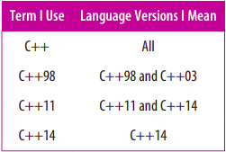
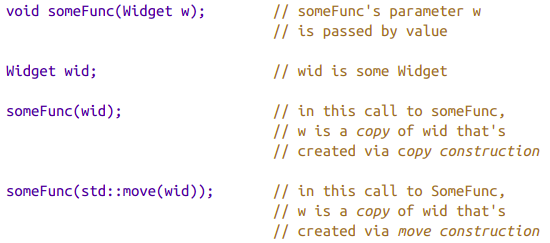

# Introduction
Nếu bạn là một lập trình viên C++ có kinh nghiệm và giống như tôi, bạn ban đầu tiếp cận C++11 với suy nghĩ, “Vâng, vâng, tôi hiểu rồi. Đó là C++, chỉ có thêm một chút.” Nhưng khi bạn học thêm, bạn sẽ ngạc nhiên bởi phạm vi của những thay đổi. Các khai báo auto, các vòng lặp dựa trên phạm vi, các biểu thức `lambda` và các tham chiếu `rvalue` thay đổi bộ mặt của C++, chưa kể đến các tính năng đồng thời mới. Và sau đó là những thay đổi về cách diễn đạt. `0` và `typedefs` không còn được ưa chuộng nữa, `nullptr` và các khai báo alias được đưa vào. `Enums` bây giờ nên được đặt phạm vi. Các con trỏ thông minh hiện nay được ưa chuộng hơn so với các con trỏ tích hợp sẵn. Việc di chuyển đối tượng thường tốt hơn là sao chép chúng.

Có rất nhiều điều để học về C++11, chưa kể đến C++14.

Quan trọng hơn, có rất nhiều điều để học về việc sử dụng hiệu quả các khả năng mới. Nếu bạn cần thông tin cơ bản về các tính năng “hiện đại” của C++, có rất nhiều tài liệu, nhưng nếu bạn đang tìm kiếm sự hướng dẫn về cách sử dụng các tính năng này để tạo ra phần mềm đúng đắn, hiệu quả, dễ bảo trì và di động, việc tìm kiếm sẽ khó khăn hơn. Đó là nơi cuốn sách này ra đời. Nó không nhằm mô tả các tính năng của C++11 và C++14, mà là cách áp dụng chúng một cách hiệu quả.

Thông tin trong cuốn sách được chia thành các Items. Bạn muốn hiểu các dạng suy luận kiểu khác nhau? Hay biết khi nào (và khi nào không) sử dụng `auto declarations`? Bạn có quan tâm tại sao các hàm thành viên `const` nên an toàn luồng, cách triển khai Pimpl Idiom bằng `std::unique_ptr`, tại sao bạn nên tránh các chế độ capture mặc định trong các biểu thức lambda, hay sự khác biệt giữa `std::atomic` và `volatile`? Tất cả các câu trả lời đều có ở đây. Hơn nữa, chúng là các câu trả lời đa nền tảng và tuân thủ các tiêu chuẩn. Đây là một cuốn sách về C++ di động.

Các Items trong cuốn sách này là những hướng dẫn, không phải là quy tắc, bởi vì hướng dẫn có những ngoại lệ. Phần quan trọng nhất của mỗi Item không phải là lời khuyên mà nó cung cấp, mà là lý do đằng sau lời khuyên đó. Sau khi bạn đã đọc được điều đó, bạn sẽ có khả năng xác định liệu các hoàn cảnh trong dự án của bạn có đủ cơ sở để vi phạm hướng dẫn của Item hay không. Mục tiêu thực sự của cuốn sách này không phải là nói cho bạn biết phải làm gì hoặc không nên làm gì, mà là truyền đạt sự hiểu biết sâu sắc về cách thức hoạt động của C++11 và C++14.
## Terminology and Conventions
Hiện tại có bốn phiên bản chính thức của C++, mỗi phiên bản được đặt tên theo năm mà Tiêu chuẩn ISO tương ứng đã được thông qua: C++98, C++03, C++11, và C++14. Các phiên bản C++98 và C++03 chỉ khác nhau về các chi tiết kỹ thuật, vì vậy trong cuốn sách này, tôi đề cập đến cả hai với thuật ngữ C++98. Khi tôi nói đến C++11, tôi đề cập đến cả C++11 và C++14, vì C++14 hiệu quả là một tập hợp con của C++11. Khi tôi viết C++14, tôi đề cập đến cụ thể là C++14. Và nếu tôi đơn giản chỉ nhắc đến C++, tôi đang đưa ra một tuyên bố tổng quát áp dụng cho tất cả các phiên bản của ngôn ngữ này.



Kết quả là, tôi có thể nói rằng C++ đặt một sự ưu tiên cao đối với hiệu suất (đúng cho tất cả các phiên bản), C++98 thiếu hỗ trợ cho concurrency (C++98 và C++03), C++11 hỗ trợ biểu thức lambda (  C++11 và C++14), và C++14 cung cấp khả năng suy luận kiểu trả về tổng quát của hàm. 

Đặc trưng quan trọng nhất của C++11 có lẽ là move semantics, và nền tảng của move semantics là phân biệt các biểu thức là `rvalues` hay `lvalues`. Điều này bởi vì `rvalues` chỉ ra các đối tượng có thể thực hiện các thao tác di chuyển, trong khi `lvalues` thường không. Trong khái niệm (mặc dù không phải lúc nào cũng trong thực tế), `rvalues` tương ứng với các đối tượng tạm thời được trả về từ các hàm, trong khi `lvalues` tương ứng với các đối tượng mà bạn có thể tham chiếu đến, bằng tên hoặc theo dấu chỉ số hoặc tham chiếu lvalue.

Một kỹ thuật hữu ích để xác định xem một biểu thức là lvalue là kiểm tra xem bạn có thể lấy địa chỉ của nó không. Nếu bạn có thể, thường thì đó là lvalue. Nếu không thể, thường là rvalue. Một tính năng của kỹ thuật này là nó giúp bạn nhớ rằng kiểu của một biểu thức thì độc lập với việc biểu thức đó là lvalue hay rvalue. Tức là, với một kiểu T cho trước, bạn có thể có `lvalues` của kiểu T cũng như `rvalues` của kiểu T. Điều này đặc biệt quan trọng khi làm việc với tham số có kiểu tham chiếu `rvalue`, bởi vì tham số đó chính là một `lvalue`:

```cpp
    class Widget {
    public:
        Widget(Widget&& rhs); // rhs is an lvalue, though it has
        …                     // an rvalue reference type
    };
```

Ở đây, hoàn toàn hợp lệ để lấy địa chỉ của `rhs` bên trong hàm khởi tạo của `Widget`, vì vậy `rhs` là một `lvalue`, mặc dù kiểu của nó là tham chiếu `rvalue`. (Theo cùng cách suy luận, tất cả các tham số đều là `lvalues`.)

Đoạn code này thể hiện một số quy ước mà tôi thường tuân theo:
* Tên class là Widget. Tôi sử dụng Widget bất cứ khi nào tôi muốn đề cập đến một type tùy ý(arbitrary) do người dùng xác định (user-defined). Trừ khi tôi cần hiển thị chi tiết cụ thể của class, tôi sử dụng Widget mà không cần khai báo nó.
* I use the parameter name rhs (“right-hand side”). It’s my preferred parameter name for the move operations (i.e., move constructor and move assignment operator) and the copy operations (i.e., copy constructor and copy assignment operator). I also employ it for the right-hand parameter of binary operators:
* Tôi sử dụng tên tham số `rhs` (“right-hand side”). Đó là tên tham số ưa thích của tôi cho các thao tác di chuyển (tức là, hàm khởi tạo di chuyển và toán tử gán di chuyển) và các thao tác sao chép (tức là, hàm tạo sao chép và toán tử gán sao chép). Tôi cũng sử dụng nó cho tham số bên phải của toán tử nhị phân:
```cpp
    Matrix operator+(const Matrix& lhs, const Matrix& rhs);
```
lhs stands for “left-hand side.”


* Tôi áp dụng định dạng đặc biệt cho các phần code hoặc các phần nhận xét để thu hút sự chú ý của bạn đến chúng. Trong hàm tạo di chuyển Widget ở trên, tôi đã đánh dấu phần khai báo `rhs` và phần nhận xét lưu ý rằng `rhs` là một giá trị. Code được đánh dấu vốn dĩ không tốt cũng không xấu. Nó chỉ đơn giản là code mà bạn nên đặc biệt chú ý đến.

* Tôi sử dụng “…” để biểu thị “mã khác có thể xuất hiện ở đây.” Dấu chấm lửng hẹp này khác với dấu chấm lửng rộng (“…”) được sử dụng trong mã nguồn cho các mẫu biến đổi của C++ 11. Nghe có vẻ khó hiểu nhưng không phải vậy. Ví dụ:
```cpp
template<typename... Ts>                // these are C++
void processVals(const Ts&... params)   // source code
{                                       // ellipses
     …                                  // this means "some
                                        // code goes here"
}
```
The declaration of processVals shows that I use typename when declaring type parameters in templates, but that’s merely a personal preference; the keyword class would work just as well. On those occasions where I show code excerpts from a C++ Standard, I declare type parameters using class, because that’s what the Standards do.

Phần khai báo của `processVals` cho thấy rằng tôi sử dụng từ khóa `typename` khi khai báo các kiểu tham số  trong các mẫu (`templates`), nhưng đó chỉ là sở thích cá nhân; từ khóa `class` cũng hoạt động tương tự. Trong những trường hợp tôi trích đoạn code từ tiêu chuẩn C++, tôi khai báo các kiểu tham số sử dụng  `class`, bởi vì đó là cách tiêu chuẩn định nghĩa.

Khi một đối tượng được khởi tạo với một đối tượng khác cùng kiểu, đối tượng mới được gọi là một bản sao của đối tượng khởi tạo, ngay cả khi bản sao được tạo thông qua hàm dịch chuyển (move constructor). Thật đáng tiếc, trong C++ không có thuật ngữ phân biệt rõ ràng giữa một đối tượng được sao chép bằng copy constructor và một đối tượng được sao chép bằng move constructor:



Các bản sao của `rvalues` thường được tạo bằng move constructed, trong khi các bản sao của `lvalues` thường được tạo bằng phương thức copy constructed. Hàm ý là nếu bạn chỉ biết rằng một đối tượng là bản sao của một đối tượng khác, không thể khẳng định được độ tốn kém của quá trình tạo bản sao đó. Trong đoạn mã trên, ví dụ, không có cách nào để biết được chi phí để tạo tham số w mà không biết liệu `rvalues` hay `lvalues` được truyền vào hàm `someFunc`. (Bạn cũng phải biết chi phí của việc di chuyển và sao chép các đối tượng Widget.)

Trong một lần gọi hàm, các biểu thức được pass tại điểm gọi hàm thì được gọi là đối số của hàm. Các đối số được sử dụng để khởi tạo các tham số của hàm. Trong cuộc gọi đầu tiên tới `someFunc` ở trên, đối số là `wid`. Trong cuộc gọi thứ hai, đối số là `std::move(wid)`. Trong cả hai lần gọi, tham số đều là `w`. Sự phân biệt giữa đối số và tham số là quan trọng, vì các tham số là `lvalues`, nhưng các đối số được khởi tạo với chúng có thể là `rvalues` hoặc `lvalues`. Điều này đặc biệt quan trọng trong quá trình chuyển tiếp hoàn hảo (perfect forwarding), trong đó một đối số được chuyển tiếp đến một hàm thứ hai sao cho tính `rvalue` hay `lvalue` của đối số gốc được bảo tồn. (Chuyển tiếp hoàn hảo được thảo luận chi tiết trong Mục 30.)